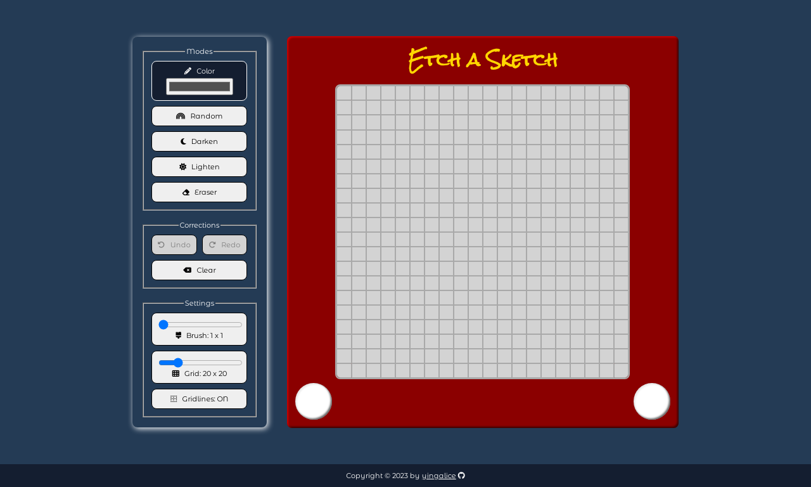
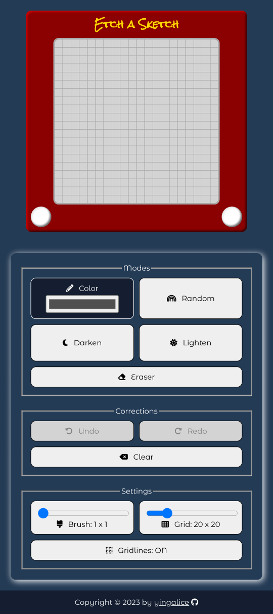

# etch-a-sketch

## Live Site
- https://yingalice.github.io/etch-a-sketch

## Description
- Sketchpad/Etch-A-Sketch toy for the browser
- Created for this Javascript [project](https://www.theodinproject.com/lessons/foundations-etch-a-sketch) in The Odin Project curriculum
- Basic features:
  - Paint modes
    - choose color
    - random color
    - darken/lighten
    - eraser
  - Other
    - clear grid
    - grid size (up to 100 x 100)
    - gridlines (show/hide)
- Extra features (more challenging):
  - undo/redo (up to 25 actions)
  - brush size (up to grid size)
  - mobile friendly - Can draw with finger, won't stop after initial touchpoint

## Goals
- Additional practice with DOM manipulation, event listeners, and mobile support

## What I learned
- Draw with finger
  - Track movements from pointermove event
    - Mouse - Use e.target
    - Touch - Use ```elementFromPoint(e.x, e.y)``` instead.  Unlike mouse, e.target only gives the initial touchpoint, and doesn't change with movement.
- Unit: vmin
  - vmin is the smallest of the viewport width *or* height.  Useful because it takes both dimensions into account.  Apply same vmin value to both width and height to ensure square grid always fits without scrolling regardless of screen orientation.
- Consolidate event listeners
  - Simplify with a pointer event, instead of separate ones for mouse and touch (ie. Use pointerdown instead of mousedown and touchstart)
- Clamp numbers
  - Keep number between a minimum and maximum: ```Math.min(Math.max(myNumber, min), max)```.  Support larger brush sizes by cropping the brush if it goes beyond the boundaries of the grid.  
- Selectors
  - :nth-child() or :nth-of-type() counts *siblings* (don't need to know parent)

## Challenges
- Undo/Redo
  - Works per brushstroke, not per cell.  Painting 50 cells in one go will undo/redo all 50.
  - When painting over the same cell multiple times in a single brushstroke, only keep the latest, and act as if prior paintings never occurred to be able to undo back to the original color
- Brush size
  - Crop the area where the brush moves off the grid.  For each brush size, consider:
    - Which cells and sides to add hover outline
    - Which cells to paint

## Image Credits
- Icons by [Font Awesome](https://fontawesome.com)
- Favicon by [Icons8](https://icons8.com)

## Screenshots
- Desktop  

- Mobile  
